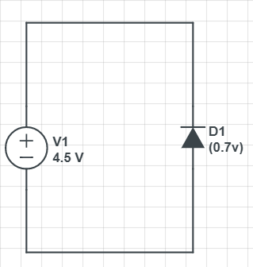
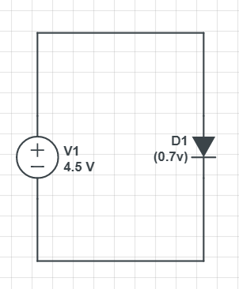
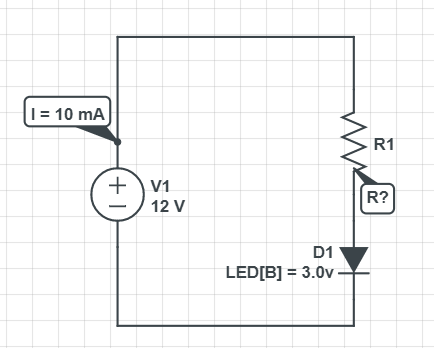
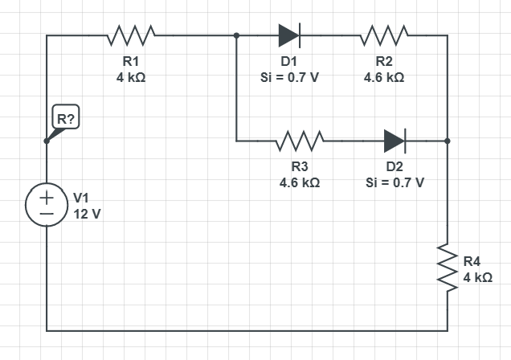
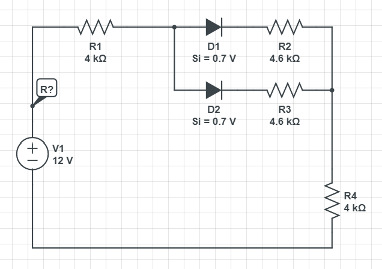
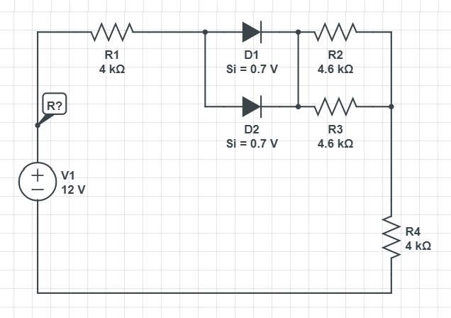
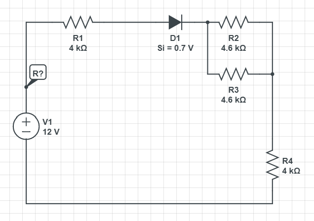
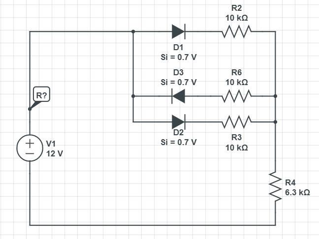

`13.03.18` `cz3`

# Dioda

### Przykład 1

Prąd nie popłynie bo dioda jest w kierunku zaporowym!

### Przykład 2

Prąd popłynie przy czym duży!  
Rezystancja diody jest bardzo mała (wynika z wykresu/wartości progowej) przez co napięcie będzie bardzo duże i najprawdopodobnie dioda po prostu zepsuje się.  

### Przykład 3

Policzyć I obwodu:

U[R1] = U - U[D1] = 4.5 V - 1.5 V = 3 V   

(Prawo Oma)  
I = U[D1] / R = 3 V / 3000 $O = 0.001 A = **1 mA**

### Przykład 4

I = 10 mA  
Policzyć R obwodu:

U[R1] = U - U[D1] = 12 V - 3 V = 9 V  

(Prawo Oma)  
I = U[R1] / R
    =>
        R = U[R1] / I = 9 V / 10 mA = **900 $O**  

### Przykład 5

Policzyć opór w obwodzie:  

**W połączeniu szeregowym kolejność nie ma znaczenia!**  

Diody w takim układzie mogą być połączone i to efektywnie nie zmieni niczego.  

**Diody rozmieszczone równolegle mogą być zastąpione przez jedną o mniejszym napięciu progowym!**

  

Dalsze kroki są banalne.
Odpowiedź: 13k $O

### Przykład 6

Policzyć opór w obwodzie:  
  

Zauważamy, że D3 jest w zaporowa. Możemy ją wytrzeć.  
Dalsze postępowanie jest analogiczne do przykładu 5.  
Odpowiedź: 13k3 $O

