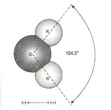
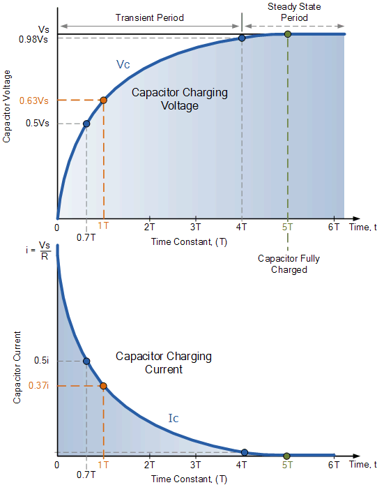
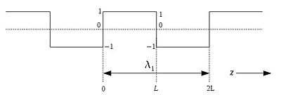
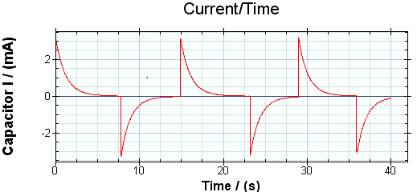
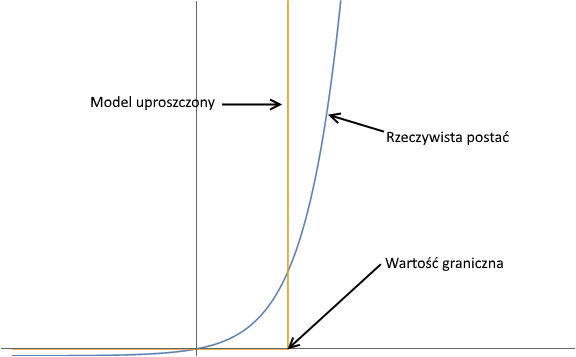
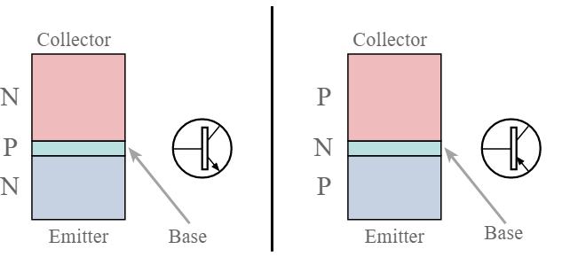
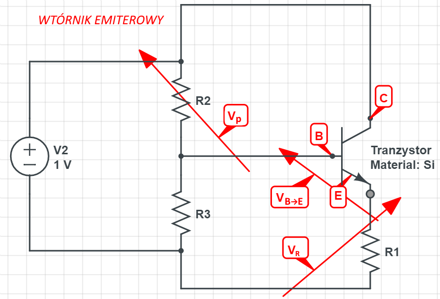

` 26.02.18` `wy1`
# organizacja

Obecność na wykładzie - obowiązkowo (ale nie ma listy)

# [Strona na serwerze liza](http://liza.umcs.lublin.pl/~skotyra) 
uzytkownik: ASyKo 
Hasło: asYkO

# Prąd
to jest uporządkowany ruch elektronów lub jonów  

### Jon
są jony dodatnie i ujemne.
oba rodzaje jonów powstają przy dysocjacji.
jony dodatnie i ujemne powstają z kwasów/zasad/soli pod wpływem wody.
jony dodatnie to kationy, a jony ujemne to aniony.

### Dysocjacja 
Gdy cząsteczka rozpada sie na dwie rożne

Na przykładzie wody:  
NaCl ∈ Chloryksod  
C₁₃H₂₂O₁₁ ∈ Sacharoza  
Gdy powyższe dodamy w wodę odbywa sie dysocjacja  
H2O Jest niesymetryczna, to powoduje, że jest ona bardziej pozytywna z jednej strony (H+)  
  
Przez co, Cl₋ przyciągany jest do H+, a Na₊ jest przyciągany do O- i tak się rozdziela  
W przypadku C₁₃H₂₂O₁₁ → C₁₃H₂₂O₁₁ (nie zmienia się)  
W przypadku NaCl → Na₊Cl₋   
gdzie + to kationy, - to aniony

# Obwody prądu
` będziemy zajmowali się tylko obwodami prądu stałego `

Elementy obwodu = Aktywne ∪ Bierne 

### Źródło napięcia 
[symbole elektroniki](https://en.wikipedia.org/wiki/Electronic_symbol)  
Może to być ogniwo lub bateria  
  
W baterii + jest przy krótkiej kresce  
Łączenie szeregowe ogniw daje sumę arytmetyczną napięć

### Prawa Kirchhoffa
1. Kiedy prąd **I** się rozdziela na **I1, I2** to suma ich napięć **I1 + I2** jest równa początkowemu **I1 + I2 = I**  
2. Suma spadków napięć (np. od rezystora), musi być równa napięciu zasilającemu

### Prawo Ohma I = V / R
(U ⇔ V)  
Opór R jest mierzony w Ohmach  

Czyli, gdy mamy opornik(resistor) **R**, pochłonie on tyle napięcia wyjściowego **V**, że na wyjściu będziemy mieć napięcie **I** takie, że **I = V / R**   
  

`05.03.18` `wy2`

Jak widać z wykresu, dla zwykłych oporników, prawo Ohma jest to po prostu funkcja liniowa o współczynniku 1/R.  
Ale prawo Ohma nie jest liniowe dla baterii i diody  

## Kondensator

 Symbol

Jest elementem biernym  
C = pojemność kondensatora mierzona w Faradach. Jest to inaczej zdolność do utrzymania ładunku  

Prawo Ohma też nie jest liniowe dla kondensatora. Jego zasilanie wygląda tak:  
  
Energia zgromadzona przez kondensator to energia pola elektrycznego które utrzymuje ładunki na okładkach kondensatora  

Typy zasilania kondensatora = całkujący ∪ różniczkujący

Niech:

U = napięcie do którego możemy naładować kondensator  
I = prąd zasilający  
I ∈ Stały  
C = pojemność kondensatora  
t = czas  

Wtedy:  
U = (I × t) / C  

Niech zatem:  
Uc = napięcie kondensatora  
Uz = napięcie zasilające  

Wtedy:  
Uc = Uz × ( 1 - e  (-t / (R × C)) )  
R × C = stała czasowa  
R × C ∈ sekundy  

Przy 5 × R × C przyjmujemy, że kondensator jest całkowicie naładowany, chociaż jak to wynika z równania, w rzeczywistości nigdy nie jest całkowicie naładowany.

### Fala prostokątna
Tak wygląda fala prostokątna:  
 

A tak wygląda zasilanie kondensatora na fonie fali prostokątnej:  
  
  

### Filtr dolnoprzepustowy
[_low-pass-filter_](https://en.wikipedia.org/wiki/Low-pass_filter)  
Polega na tym, że zmienność napięcia na źródle napięcia jest _wygładzana_ przez kondensator  
  
Widać też, że dolny wykres jest _opóźniony_, oznacza to że ma przemieszczoną fazę

## Cewka (Element indukcyjny)  
 Symbol

Przechowuje energię w postaci pola magnetycznego  
Jest w jakimś stopniu przeciwieństwem kondensatora  
Dużo rzeczy komplikuje, dlatego często się jej unika, jak też np. w kursie architektur na UMCS  

# Elementy półprzewodnikowe
## Def: półprzewodniki

    Są to substacje których konduktywność może być zmieniana w szerokim zakresie.
    Czyli mogą pełnić role przewodników bądź izolatorów.
    Ich konduktywność zależy m. in. od temperatury, oświetlenia, innych elementów (domieszek)  
---
    Półprzewodniki = Samoistne ∪ Domieszkowane

Si _(krzem)_, Al _(glin)_, Ge ∈ Półprzewodniki samoistne

`12.03.18` `wy3`

## Struktura półprzewodników samoistnych

Przyjmuje się, że w temperaturze zera bezwzględnego w _paśmie przewodnictwa_ nie ma elektronów, natomiast w wyższej temperaturze powstają pary elektron–dziura; im większa wartość temperatury, tym więcej takich par jest generowanych.  

Na przykładzie Si:  
Jak mamy temperaturę = Abs 0, każdy atom Si ma 4 elektrony na powłoce wałencyjnej. Atomy Si tworzą sieć gdzie każdy z 4 elektronów ma powiązanie z elektronem sąsiadującego atomu Si.  
  
Natomiast gdy temperatura zwiększa się, niektóre z tych elektronów zrywają połączenia, tworząc na tym miejscu **dziurę**  

### Def : powłoka walencyjna
Jest to ostatnia, najdalej odsunięta od jądra powłoka elektronowa atomu. Elektrony na niej są najsłabiej związane z atomem przez co mogą przemieszczać się między sąsiadującymi atomami i uczestniczyć w tworzeniu wiązań chemicznych. W przypadku elektronów znajdujących się niżej zazwyczaj nie jest to możliwe, choć są od tego liczne wyjątki.
### Def : pasmo przewodnictwa
Jest to z analogii obszar w którym elektrony są najsłabiej powiązane z atomami i swobodnie przemieszczają się między nimi.  

  

## Domieszkowanie
Dodawanie do połprzewodników samoistnych innych elementów **z tego samego [okresu](https://pl.wikipedia.org/wiki/Uk%C5%82ad_okresowy_pierwiastk%C3%B3w#Wygl%C4%85d_wsp%C3%B3%C5%82czesnego_uk%C5%82adu_okresowego)** układu pierwiastków.  

Efekt będzie zależać od tego czy dodane pierwiastki mają więcej elektronów na powłoce walencyjnej, czy mniej.  
- **Więcej**  
    Jeśli do Si, który ma 4 elektrony, dodamy P, który ma 5, okaże się, że podczas tworzenia sieci, dla tego 1 nadmiarowego elektronu już nie będzie miejsca na powłoce walencyjnej i przejdzie on na poziom wyżej (poziom _donorowy_), a to też oznacza, że nie będzie tak on mocno przywiązany do jednego miejsca w wyniku czego takie połączenie Si+P zmniejsza opór przewodnika.  
    Takiego typu połączenie nazywamy **typu N** (bo są nadmiarowe elektrony → Negative potential)   
- **Mniej**  
    Jeśli do tego samego Si dodamy Al, który ma 3 elektrony na powłoce walencyjnej, wtedy w połączeniach między Si a Al będzie brakowało jednego elektronu, co nazywamy _dziurą_. W wyniku utworzenia wolnych miejsc, tutaj podobnie powstaje nowy poziom - _akceptorowy_ co sprzyja szybszemu przemieszczeniu elektronów(dziur) (czyli mniejszej oporności). Tego typu półprzewodniki nazywamy **tupy P** (od Positive bo brakuje elektronów)  

## Zalety domieszkowania
Jak już było wspomniano, domieszkowanie zmniejsza opór samoistnych półprzewodników, natomiast najwyższa użyteczność powstaje przy połączeniu dwóch materiałów o typie P i typie N.  

## Dioda
 (K: katoda-, A: anoda+)

Najbardziej ciekawą częścią diody, jest obszar styku materiałów o typie P i N. Odbywa się na tym obszarze tzw. _rekombinacja_ elektronów i dziur, co znaczy, że elektrony materiału o typie N, uzyskują dostęp do niższych poziomów w miejscach połączenia pierwiastków materiału typu P, gdzie domyślnie są dziury. Naturalnie powstaje ruch elektronów (=prąd) i uwolnienie energii w postaci światła (najczęściej).  

## Dioda + bateria
Dioda przepuszcza prąd tylko w jednym kierunku.

## Konduktywność diody

:  
I = Is × (e Ud / (n × Vt))  - 1)  

Wzór ten można uprościć, gdyż Ud, n, Vt ∈ stałe  
Niech zatem  
α = Ud / (n × Vt)  
Wtedy  
I = Is × (e  α  - 1)  

Żeby było jeszcze prościej umawiamy się, że dla diody funkcja napięcia jest wyznaczona przez wartość progową chociaż w rzeczywistości ma ona postać wykładniczą.  

Ta wartość progowa jest oszacowywana eksperymentalnie.  
O to kilka przykładowych wartości:  

| Model/Material diody | Napięcie progowe |
| --- | --- |  
| Ge                   | 0.3 V            |
| Si                   | 0.7 V            |
| LEDRGY    | 1.3 V            |
| LEDBW     | 3.0 V            |

`19.03.18` `wy4`

# Tranzystor

Jest podobny do diody, ale ma 3 warstwy półprzewodnika

  

Są więc dwa typy tranzystorów: NPN i PNP  
Gdzie P to półprzewodnik domieszkowany "pozytywnie" a N odpowiedznio - "negatywnie".  
Każda z tych części ma nazwę:
- Emiter (oznaczony przez E) warstwa silnie domieszkowana. Na rysunku - strzałka
- Baza (oznaczona przez B) warstwa cienka i słabo domieszkowana. Na rysunku - linia prostopadła 
- Kolektor (oznaczony przez C)

Dla tranzystora działa 1 prawo kirchoffa:  
IEmitera = IBazy + ICollector'a  

Ale ponadto dla rezystora zachodzi:  
IC = β × IB  
gdzie: β ⇔ hEF ⇔ h21E ⇔ _"Współczynnik wzmocnienia prądowego"_  
β ∈ A ∪ B ∪ C  
gdzie: A $= (100, 200], B $= (200, 400], C $= (400, +∞)  

β mówi o tym ile elektronów kolektora przypada na jeden elektron bazy.  
Jeśli prąd kolektora jest stały, to prąd bazy w największym stopniu decyduje o prądzie emitera wszystkich pozostałych czynników  

### Przykład 1
"Wtórnik emiterowy"  

  
Dla kolejnych wartości szukamy rezystancję Baza-Emitor  

| Vp | β | R₁ | VR | IE | IB | RB→E |  
| --- | --- |  
| 0.6 V | 100 | 0.6 V | 100 Ω | 0 V | 0 A | 0 A | ∞ Ω |  
| 0.7 V | 100 | 0.6 V | **100** Ω | 0.1 V | 1 mA | 10 uA | **10** kΩ |  
| 0.8 V | 100 | 0.6 V | **100** Ω | 0.2 V | 2 mA | 20 uA | **10** kΩ |  
| 0.7 V | 100 | 0.6 V | **200** Ω | 0.1 V | 0.5 mA | 5 uA | **20** kΩ |  
| 0.8 V | 100 | 0.6 V | **200** Ω | 0.2 V | 1 mA | 10 uA | **20** kΩ |  

